<samp>IT ENGINEER · BACKEND</samp>

 

<samp>backend systems · network tooling · delivery automation</samp>

  

> C# ve .NET ile Windows üzerinde çalışan ağ, sistem ve otomasyon araçları geliştiriyorum. 
> I build networking, systems and automation tools for Windows with C# and .NET.

Backend servislerini yalnızca çalışan endpoint'ler olarak değil; veri modeli, kimlik doğrulama, 
gözlemlenebilirlik, test, dağıtım ve operasyon süreçleriyle birlikte ele alıyorum.

I treat backend services as complete operational systems: data model, authentication, 
observability, testing, delivery and maintainability all belong to the same design.

Windows tarafında ağ keşfi ve paket analizinden masaüstü otomasyonlarına; web tarafında 
ASP.NET Core API'lerinden React/Next.js istemcilerine kadar uçtan uca çalışıyorum.

My work ranges from Windows network discovery and packet analysis to desktop automation, 
ASP.NET Core APIs and React/Next.js clients.

- **Backend mimarisi / Backend architecture** — REST API tasarımı, katmanlı servisler, hata yönetimi ve sürdürülebilir veri akışları.
- **Veri / Data** — PostgreSQL, Entity Framework Core, Npgsql ve kontrollü SQL migration süreçleri.
- **Kimlik ve güvenlik / Identity and security** — JWT tabanlı yetkilendirme, secret yönetimi ve güvenli varsayılanlar.
- **Kalite / Quality** — xUnit, Vitest ve Playwright ile servis, entegrasyon ve uçtan uca testler.
- **Teslimat / Delivery** — Docker, GitHub Actions, otomatik build/test akışları ve tekrarlanabilir dağıtımlar.
- **Ağ sistemleri / Network systems** — cihaz keşfi, protokol parmak izi, paket yakalama ve PCAP analizi.

**[Beeyazilim](https://github.com/beeyazilim)** organizasyonunda backend, web istemcisi, 
veri katmanı, test altyapısı ve CI/CD süreçlerine katkı sağlıyorum.

I contribute to backend services, web clients, data layers, test infrastructure and 
CI/CD workflows within **[Beeyazilim](https://github.com/beeyazilim)**.

Organizasyon depoları özeldir. Bu nedenle depo adları, ürün detayları ve kaynak kod bilgileri 
burada yayımlanmaz; aşağıdaki özet yalnızca doğrulanmış teknoloji sinyallerini ve toplu katkı 
verilerini içerir.

The organization repositories are private. Repository names, product details and source 
information stay private; only verified technology signals and aggregate contribution data 
are presented here.

İzlenen dil ayak izi / Observed language footprint: 
<samp>HTML · C# · TypeScript · JavaScript · PL/pgSQL · CSS · Shell · PowerShell · Dockerfile</samp>

**Backend & API** 
<samp>ASP.NET Core · REST · Entity Framework Core · Npgsql · PostgreSQL · JWT · OpenAPI/Swagger · Serilog</samp>

**Web client** 
<samp>React · Next.js · TypeScript · Vite · Tailwind CSS</samp>

**Testing & quality** 
<samp>xUnit · Vitest · Playwright · integration tests · end-to-end tests · refactoring</samp>

**Platform & delivery** 
<samp>Docker · GitHub Actions · SQL migrations · automated build/test · release workflows</samp>

**Windows & network engineering** 
<samp>.NET 8/10 · WPF · WinForms · SQLite · Npcap · tshark/Wireshark · PowerShell</samp>

Son erişilebilir organizasyon geçmişinden incelenen örneklem: 
Snapshot derived from the latest accessible organization history:

| Sinyal / Signal | Doğrulanmış örneklem / Verified sample |
|---|---:|
| Organizasyon commitleri / Organization commits | **198+** |
| Test odaklı değişiklikler / Testing-oriented changes | **56** |
| Backend değişiklikleri / Backend changes | **47** |
| Hata düzeltmeleri / Fixes | **29** |
| Refactor çalışmaları / Refactors | **17** |
| Veri migration değişiklikleri / Data migrations | **15** |
| Kimlik doğrulama değişiklikleri / Authentication changes | **10** |
| Docker odaklı değişiklikler / Docker-oriented changes | **8** |
| API değişiklikleri / API changes | **7** |
| Dağıtım değişiklikleri / Deployment changes | **5** |
| Cache değişiklikleri / Cache changes | **5** |
| Ağ değişiklikleri / Network changes | **5** |
| Arayüz değişiklikleri / UI changes | **5** |
| Güvenlik değişiklikleri / Security changes | **2** |
| Loglama değişiklikleri / Logging changes | **2** |
| CI değişiklikleri / CI changes | **1** |

<samp>C# · .NET · ASP.NET Core · EF Core · PostgreSQL · Npgsql · SQLite · REST · JWT · OpenAPI</samp>

<samp>React · Next.js · TypeScript · Vite · Tailwind CSS · HTML · CSS · JavaScript</samp>

<samp>xUnit · Vitest · Playwright · Docker · GitHub Actions · PowerShell · Git</samp>

<samp>WPF · WinForms · networking · Wireshark/tshark · Npcap · PCAP analysis</samp>

- **Ölçülebilirlik / Measurability** — log, test ve çalışma zamanı sinyalleri olmadan bir özellik tamamlanmış sayılmaz.
- **Tekrarlanabilirlik / Repeatability** — elle yapılan adımlar build, migration veya workflow içinde otomatikleştirilir.
- **Güvenli varsayılanlar / Secure defaults** — yetki, secret ve dış girdiler açıkça sınırlandırılır.
- **Küçük ve geri alınabilir değişiklikler / Small reversible changes** — refactor ve migration'lar kontrollü parçalar hâlinde ilerler.
- **Gerçek kullanım / Real usage** — araçlar masaüstünde, ağ üzerinde ve CI ortamında gerçek akışlarla doğrulanır.
- **Gizlilik / Confidentiality** — özel organizasyon kodu ve ürün ayrıntıları kamu profilinden bilinçli olarak ayrılır.

**[ag-tarama](https://github.com/Crakkadmr/ag-tarama)** · <samp>C# · .NET 10 · WPF · networking</samp> 
Aktif/pasif cihaz keşfi, paket yakalama, protokol parmak izi ve yapay zekâ destekli 
PCAP analizi sunan Windows ağ çalışma alanı. 
Windows network workspace with active/passive discovery, packet capture, 
protocol fingerprinting and AI-assisted PCAP analysis.

Temel alanlar / Core areas: <samp>SSDP · mDNS · LLMNR · MQTT · RTSP · SMB · ARP · ICMP · Wireshark</samp>

**[AIO-Installer](https://github.com/Crakkadmr/AIO-Installer)** · <samp>C# · .NET Framework · WinForms</samp> 
Yerel ve çevrimiçi uygulamaları toplu ve sessiz şekilde kuran Windows yazılım yöneticisi. 
Windows software manager for batch and unattended local or online installations.

Temel alanlar / Core areas: <samp>batch installation · unattended setup · XML catalog · progress tracking</samp>

**[KutuphaneOtomasyonu](https://github.com/Crakkadmr/KutuphaneOtomasyonu)** · <samp>C# · .NET 8 · SQLite</samp> 
Rol tabanlı erişim, katalog, ödünç/iade ve raporlama özellikli masaüstü otomasyonu. 
Desktop library workflow with role-based access, cataloguing, lending and reporting.

Temel alanlar / Core areas: <samp>role-based access · cataloguing · lending · CSV export · local media</samp>

**[deytla-scanner-releases](https://github.com/Crakkadmr/deytla-scanner-releases)** · <samp>Windows releases</samp> 
Doğrulanmış Windows kurulum paketleri için ayrılmış sürüm ve dağıtım kanalı. 
Release and distribution channel for verified Windows installation packages.

Bu profildeki tüm grafikler doğrudan bu depoda üretilir. ASCII portre 
[`scripts/generate_portrait.py`](scripts/generate_portrait.py) ile fotoğraftan oluşturulur; 
katkı, seri, dil ve yıllık aktivite grafikleri ise her gün 
[`refresh-profile.yml`](.github/workflows/refresh-profile.yml) tarafından yenilenir.

Every graphic on this profile is generated inside this repository. The ASCII portrait 
comes from the source photo through [`scripts/generate_portrait.py`](scripts/generate_portrait.py); 
contribution, streak, language and yearly activity graphics are refreshed daily by 
[`refresh-profile.yml`](.github/workflows/refresh-profile.yml).

İstatistik workflow'u yalnızca GitHub'ın yerleşik `GITHUB_TOKEN` yetkisini kullanır ve 
herkese açık depo verilerini okur. Beeyazilim özeti gizlilik nedeniyle yerel olarak doğrulanmış, 
anonimleştirilmiş ve statik bir alt sınır olarak tutulmuştur.

The statistics workflow uses only GitHub's built-in `GITHUB_TOKEN` and reads public repository 
data. The Beeyazilim snapshot is locally verified, anonymized and kept as a static lower bound 
so private organization details never enter the public automation.

No third-party stat cards, no external image services, and no personal access token.
