 
<samp>IT ENGINEER · BACKEND</samp>

 

<samp>backend systems · network tooling · delivery automation</samp>

  

> C# ve .NET ile Windows üzerinde çalışan ağ, sistem ve otomasyon araçları geliştiriyorum. 
> I build networking, systems and automation tools for Windows with C# and .NET.

Backend servislerini yalnızca çalışan endpoint'ler olarak değil; veri modeli, kimlik doğrulama, 
gözlemlenebilirlik, test, dağıtım ve operasyon süreçleriyle birlikte ele alıyorum.

I treat backend services as complete operational systems: data model, authentication, 
observability, testing, delivery and maintainability all belong to the same design.

Windows tarafında ağ keşfi ve paket analizinden masaüstü otomasyonlarına; web tarafında 
ASP.NET Core API'lerinden React/Next.js istemcilerine kadar uçtan uca çalışıyorum.

My work ranges from Windows network discovery and packet analysis to desktop automation, 
ASP.NET Core APIs and React/Next.js clients.

